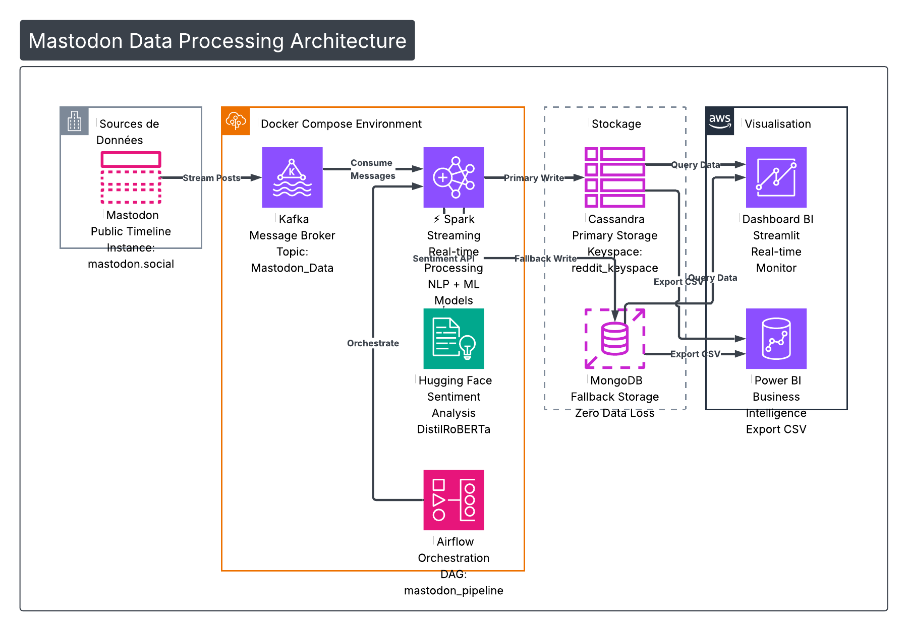

# 🚀 BIG_DATA_PIPLINE — Reddit / Mastodon Sentiment & Virality Pipeline

**Repository:** [github.com/saghro/BIG_DATA_PIPLINE](https://github.com/saghro/BIG_DATA_PIPLINE)  
**Maintainer:** [@saghro](https://github.com/saghro)

An end-to-end Big Data engineering project that ingests financial discussions from Reddit or Mastodon, processes them in real-time using Spark Streaming and Machine Learning, and stores the results for visualization.

> **Note:** This repository is a fork / personal continuation of an academic group project. The original authors are credited below in [Acknowledgments](#-acknowledgments-original-authors).

This architecture features a hybrid storage solution (NoSQL primary + document fallback) and a robust mechanism ensuring **zero data loss** during streaming.

---

## 🏗 Mastodon Data Processing Architecture

The diagram below shows the **end-to-end data flow** from the Mastodon public timeline to dashboards and BI tools. All core services run inside **Docker Compose** unless noted.

### Layers (summary)

| Layer | Components | Role |
| :--- | :--- | :--- |
| **Sources** | Mastodon (`mastodon.social`) | **Public timeline** — posts are streamed in real time (no API key). |
| **Docker Compose** | **Kafka** (topic `Mastodon_Data`) | Message broker between ingestion and Spark. |
| | **Spark Structured Streaming** | Consumes Kafka, runs NLP + ML (LDA, Random Forest, sentiment). |
| | **Hugging Face / DistilRoBERTa** *(optional in diagram)* | Sentiment analysis can be integrated alongside keyword-based UDF in Spark. |
| | **Apache Airflow** (DAG `mastodon_pipeline`) | Orchestrates ingestion and Spark jobs (`run_mastodon` → `run_spark`). |
| **Storage** | **Apache Cassandra** (keyspace e.g. `reddit_keyspace`) | **Primary write** — high-throughput time-series style storage. |
| | **MongoDB** | **Fallback write** — if Cassandra fails, batches go here (**zero data loss**). |
| **Visualization** | **Streamlit** (`dashboard_bi.py`) | Real-time BI-style monitor (queries Cassandra / fallback). |
| | **Power BI** | Business intelligence via CSV export from Cassandra or MongoDB. |

### Data flow (high level)

1. **Mastodon** → stream filtered posts → **Kafka** (`Mastodon_Data`).
2. **Kafka** → **Spark Streaming** (micro-batches) + **Airflow** orchestration.
3. **Spark** → **Cassandra** (primary) or **MongoDB** (automatic fallback).
4. **Cassandra** / **MongoDB** → **Streamlit** (queries) and **Power BI** (export CSV).

*Source file for edits / Mermaid variant:* see also [`architecture_mastodon.mmd`](architecture_mastodon.mmd).

---

## 📖 Project Overview

This pipeline is designed to detect viral financial trends on Reddit (e.g., r/Bitcoin, r/CryptoCurrency) in real-time. It performs the following operations:

1.  **Ingestion:** Fetches live data from **Mastodon** (public timeline) and pushes it to **Kafka**.
2.  **Inference (Streaming):**
    * **Spark Structured Streaming** consumes Kafka topics.
    * **NLP/Sentiment Analysis:** Simple keyword-based sentiment analysis (Positive/Negative/Neutral).
    * **Topic Modeling:** Identifies subjects dynamically using LDA.
    * **Virality Prediction:** Uses Random Forest to predict if a post will become "HOT".
4.  **Storage:**
    * **Primary Storage:** **Apache Cassandra** (Docker Container).
        * *Status:* Active Default. Optimized for high-throughput, write-heavy streaming workloads.
    * **Fallback Storage:** **MongoDB** (Running on Host Machine/Container).
        * *Status:* Failover (Triggered automatically if Cassandra is unreachable).

> > **💡 Architectural Note:**
> In this production-ready design, **Apache Cassandra** serves as the primary sink due to its linear scalability and excellence in handling high-velocity time-series data typical of financial streams. 
> 
> To ensure maximum reliability, we have implemented **MongoDB** as a secondary fallback. This ensures that even during periods of high cluster pressure or potential node failure in Cassandra, the data stream remains uninterrupted and is safely persisted in the document store.
>
> **Why MongoDB for Fallback?** Unlike column-oriented databases like ClickHouse or Cassandra, which enforce a strict **Schema-on-write** policy, MongoDB is **schemaless**. In a real-time streaming context, if the Reddit API evolves or modifies its data structure, a rigid schema might reject the ingestion, causing data loss. MongoDB acts as a "highly-permissive" safety net, gracefully accepting structural variations to ensure **Zero Data Loss** until the primary system is restored or updated.

5.  **Orchestration:** Apache Airflow manages the workflow (DAG `mastodon_pipeline`).
6.  **Visualization:** **Streamlit** dashboard (`dashboard_bi.py`) and **Power BI** (CSV export from Cassandra / MongoDB).

---

## 🛠 Tech Stack

### Infrastructure & Orchestration
* **Docker & Docker Compose:** Full containerization.
* **Apache Airflow:** Workflow orchestration (DAGs).
* **Apache Kafka:** Event streaming and ingestion.

### Processing & Machine Learning
* **Apache Spark (PySpark):** Structured Streaming, SparkML.
* **FastAPI:** Microservice for the Transformer model.
* **HuggingFace:** `mrm8488/distilroberta-finetuned-financial-news-sentiment-analysis`.
* **Spark ML:** Random Forest, LDA, Word2Vec, CountVectorizer.

### Storage
* **Apache Cassandra:** Primary NoSQL database for real-time analytics.
* **MongoDB:** Document store used as a robust fallback mechanism.

---

## 📂 Docker Services

The infrastructure is defined in `docker-compose.yml`:

| Service Name | Description | Port (Host) |
| :--- | :--- | :--- |
| **broker** | Kafka Message Broker | 9092 / 9093 |
| **spark-master** | Spark Master Node | 8083 (UI) / 7077 |
| **spark-worker** | Spark Worker Node | 8084 |
| **cassandra** | Primary NoSQL Sink | 9042 |
| **mongodb** | Fallback Database | 27018 |
| **airflow-webserver** | Airflow UI | 8091 |
| **airflow-scheduler** | Airflow Scheduler | - |

---

## ⚙️ Key Features & Logic

### 1. Sentiment Analysis
Simple keyword-based sentiment analysis performed directly in Spark.
* **Method:** Keyword matching (positive/negative words).
* **Output:** Sentiment labels (Positive/Negative/Neutral).

### 2. The Inference Engine (`RedditInferenceEngine`)
Running on Spark, this engine handles the complexity:
* **Dynamic Topic Naming:** It maps LDA mathematical vectors to human-readable topics (e.g., "wallet-key-lost") using a custom UDF.
* **Virality Scoring:** Predicts a score and assigns a category:
    * 🔥 **HOT** (Score > 5)
    * 📈 **UP** (Score > 2)
    * 💤 **LOW** (Else)
* **Fault Tolerance:** Implements a `try-catch` block for data persistence. The system attempts to write to **Cassandra** first. If the connection fails or a timeout occurs, the batch is automatically redirected to **MongoDB**, ensuring zero data loss during ingestion.

---

## 📈 Visualization

Data processed by Spark can be explored with **Streamlit** (real-time monitoring) and **Power BI** (sentiment trends and topic virality).

---

## 📊 Monitoring

You can monitor the health and status of the pipeline using the following interfaces:

* **Spark Master UI:** [http://localhost:8083](http://localhost:8083)
    * *Use this to monitor active streaming queries, worker status, and memory usage.*
* **Airflow UI:** [http://localhost:8091](http://localhost:8091)
    * *Use this to view logs, retry failed tasks, and monitor pipeline execution time.*

---

## 👤 Maintainer (this fork)

* **[@saghro](https://github.com/saghro)** — owner of this repository, ongoing changes and documentation.

## 🙏 Acknowledgments (original authors)

The initial pipeline was jointly designed and developed by:

* [EL RHERBI Mohamed Amine](https://github.com/medamineelrherbi)
* [CHATRAOUI Hamza](https://github.com/chatraouihamza)
* [DHAH Chaimaa](https://github.com/ChaimaaDhah)
* [EL Houdaigui Maria](https://github.com/mariaelhoudaigui)
* [AMMAM Yassir](https://github.com/yassiraamam)

Original upstream context: group Big Data project (Reddit pipeline). This fork adds Mastodon ingestion, demo scripts, LaTeX docs, and other personal updates.

## 📝 License

This project is open-source and available under the [MIT License](https://opensource.org/licenses/MIT).
